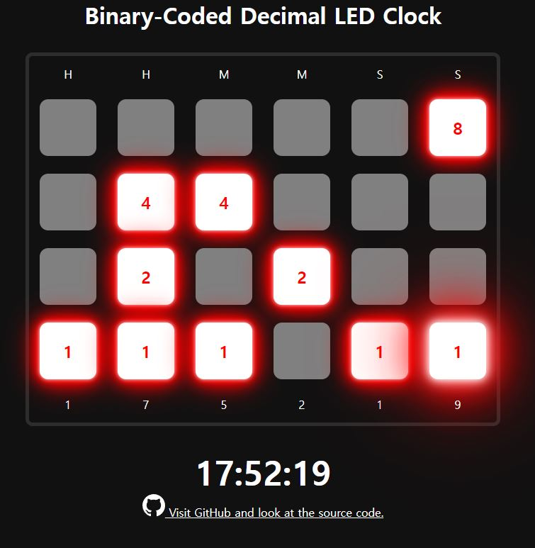

# BCD-clock

A Binary-Coded Decimal clock.

## Showcase

## What is Binary-Coded Deciaml clock?

Go to Wikipedia to see the details.

[Binary-Coded Decimal](https://en.wikipedia.org/wiki/Binary_clock)